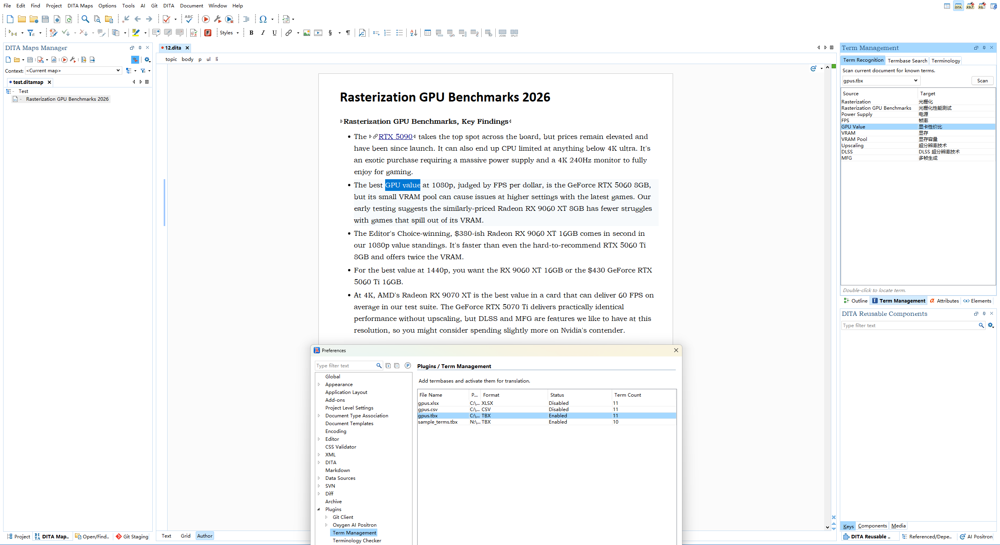

# Term Management

Oxygen XML Editor plugin for terminology management and translation assistance.

## Screenshots



## Features

### Term Recognition
- Scan the current editor document for terms from enabled termbases
- Supports both Author and Text editing modes
- Double-click a matched term to locate it in the document
- Auto-scan on tab switch and editor change

### Terminology Management
- Add, edit, delete terms in individual termbases (TBX / XLSX / CSV)
- Quick-Add: create a term from the current editor selection
- Batch delete with confirmation

### Termbase Search
- Fuzzy search across all enabled termbases
- Searches both source and target terms

### Termbase Configuration (Preferences)
- Add / Remove termbases via file chooser
- Enable / Disable termbases without removing them
- Edit opens termbase file in system default application
- Reload termbase from disk

## Requirements

- **Oxygen XML Editor** 27 or 28
- **Java** 17+
- **Maven** 3.6+ (for building)

## Build

```bash
mvn clean package
```

The deployable plugin package will be available at `output/term-management/`.

## Installation

1. Build the plugin (see above).
2. Copy the output directory to Oxygen's plugins folder:
   ```bash
   cp -r output/term-management/ <OXYGEN_HOME>/plugins/term-management/
   ```
3. Restart Oxygen XML Editor.
4. Open the **Term Management** view from `Window > Show View > Term Management`.
5. Configure termbases at `Preferences > Plugins > Term Management`.

## Usage

### Configuration (Preferences)
1. Go to `Preferences > Plugins > Term Management`.
2. Click **Add** to select a TBX / XLSX / CSV file.
3. Select a termbase and click **Enable** / **Disable** to control its availability.
4. Click **OK** or **Apply** to save.

### Term Recognition
1. Open an XML document in Author or Text mode.
2. In the **Term Recognition** tab, select a termbase from the dropdown.
3. Click **Scan** (or switch tabs to auto-scan).
4. Matched terms appear in the table. **Double-click** any row to jump to that term in the editor.

### Terminology Management
1. Switch to the **Terminology** tab.
2. Select a termbase from the dropdown.
3. Use the toolbar buttons to manage terms:
   - **Reload** — re-read the termbase from disk
   - **Add** — add a new term manually
   - **Quick Add** — add a term using the current editor selection as source
   - **Edit** — modify the selected term (single selection only)
   - **Delete** — remove selected term(s) (supports multi-select)

### Termbase Search
1. Switch to the **Termbase Search** tab.
2. Enter a search term and click **Search** (or press Enter).
3. Results are shown from all enabled termbases.

## Supported Formats

| Format | Library | Notes |
|--------|---------|-------|
| CSV | OpenCSV | UTF-8, first row header, BCP 47 language tags |
| XLSX | Apache POI | First sheet, first row header |
| TBX (ISO 30042) | JDK DOM | xml:lang attributes for language detection |

## Project Structure

```
term-management/
├── plugin.xml                 # Oxygen plugin descriptor
├── extension.xml              # Extension registration
├── pom.xml                    # Maven build
├── LICENSE
├── README.md
├── i18n/                      # Internationalization resources
│   ├── messages_en.properties
│   └── messages_zh.properties
├── licenses/                  # Third-party license files
├── libs/                      # Oxygen SDK and other local JARs
├── src/main/java/com/example/termmgmt/
│   ├── TermManagementPlugin.java
│   ├── TermManagementWorkspaceAccessExtension.java
│   ├── model/
│   │   ├── TermEntry.java
│   │   └── TermbaseConfig.java
│   ├── service/
│   │   ├── TermbaseLoader.java
│   │   ├── CsvTermbaseHandler.java
│   │   ├── XlsxTermbaseHandler.java
│   │   ├── TbxTermbaseHandler.java
│   │   └── TermbaseRegistry.java
│   ├── prefs/
│   │   └── TermManagementPreferencePage.java
│   └── ui/
│       ├── TermManagementView.java
│       ├── TermRecognitionPanel.java
│       ├── TermbaseSearchPanel.java
│       ├── TerminologyPanel.java
│       └── TermEntryDialog.java
└── output/                    # Build output (not committed)
    └── term-management/
```

## Development

### Prerequisites
- JDK 17+
- Apache Maven 3.6+
- Oxygen XML Editor 27+ (for SDK JARs and testing)

### Building
```bash
mvn clean package
```

### IntelliJ IDEA Setup
1. Open the project directory.
2. Ensure the project SDK is set to JDK 17.
3. Run Maven `package` goal to verify the build.

### Adding Oxygen SDK Dependencies
The Oxygen SDK JARs (`oxygen.jar`, etc.) are included in `libs/` and are referenced from the local Maven repository. Refer to `pom.xml` for the repository configuration.

## License

Apache License 2.0
