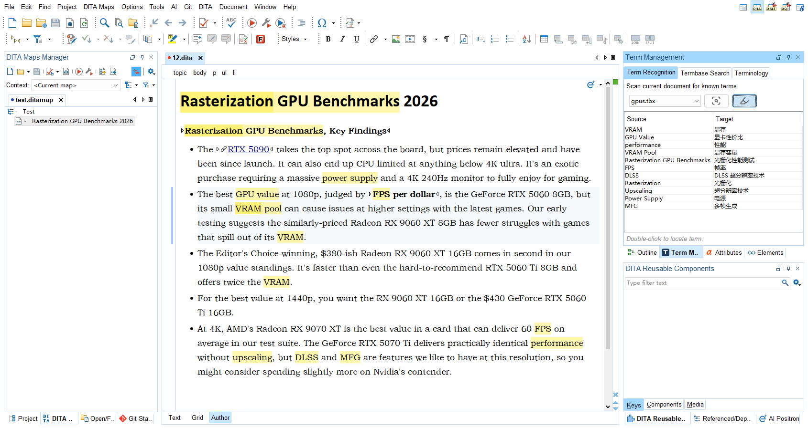
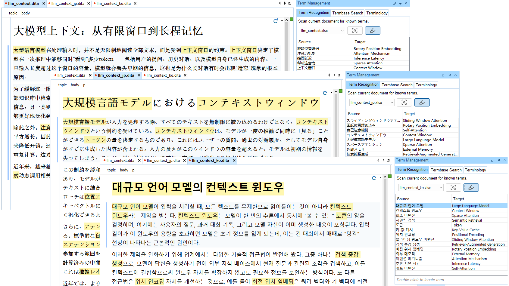

# 术语管理 (Term Management)

Oxygen XML Editor 插件，用于术语管理和翻译辅助。

## 截图





## 功能特性

### 术语识别
- 扫描当前编辑器文档，匹配已启用的术语库中的术语
- 支持 Author 和 Text 两种编辑模式
- **Author 模式高亮** — 一键开关高亮，匹配的术语在文档中以黄色背景标记
- **CJK 支持** — 正确识别中文、日文、韩文文本，无需依赖空格分隔
- 双击匹配的术语行即可跳转到文档中对应位置
- 切换标签页或编辑器时自动扫描
- **主题感知 SVG 图标** — 图标自动适配 Oxygen 深色/浅色主题

### 术语管理
- 在单个术语库（TBX / XLSX / CSV）中添加、编辑、删除术语
- 快速添加：从当前编辑器选区创建术语
- 批量删除（带确认提示）

### 术语库搜索
- 在所有已启用的术语库中模糊搜索
- 同时搜索源语和目标语术语

### 术语库配置（首选项）
- 通过文件选择器添加/移除术语库
- 启用/禁用术语库（无需移除）
- 编辑操作用系统默认应用打开术语库文件
- 从磁盘重新加载术语库

## 环境要求

- **Oxygen XML Editor** 27 或 28
- **Java** 17+
- **Maven** 3.6+（用于构建）

## 构建

```bash
mvn clean package
```

构建产物位于 `output/term-management/`。

## 安装

1. 构建插件（见上方）。
2. 将输出目录复制到 Oxygen 的 plugins 文件夹：
   ```bash
   cp -r output/term-management/ <OXYGEN_HOME>/plugins/term-management/
   ```
3. 重启 Oxygen XML Editor。
4. 通过 `Window > Show View > Term Management` 打开 **术语管理** 视图。
5. 在 `Preferences > Plugins > Term Management` 中配置术语库。

## 使用指南

### 首选项配置
1. 进入 `Preferences > Plugins > Term Management`。
2. 点击 **Add** 选择 TBX / XLSX / CSV 文件。
3. 选中一个术语库，点击 **Enable** / **Disable** 控制其可用状态。
4. 点击 **OK** 或 **Apply** 保存。

### 术语识别
1. 在 Author 或 Text 模式下打开 XML 文档。
2. 在 **术语识别** 标签页中，从下拉框选择一个术语库。
3. 点击 **Scan**（或切换标签页以自动扫描）。
4. 匹配的术语显示在表格中。**双击**任意行即可在编辑器中跳转至该术语。
5. **高亮开关** — 在 Author 模式下开关术语高亮，匹配的术语在文档中可见标记。每个文档独立记忆开关状态。

### 术语管理
1. 切换到 **术语管理** 标签页。
2. 从下拉框选择一个术语库。
3. 使用工具栏按钮管理术语：
   - **Reload** — 从磁盘重新读取术语库
   - **Add** — 手动添加新术语
   - **Quick Add** — 使用当前编辑器选区作为源语快速添加术语
   - **Edit** — 修改选中的术语（仅支持单选）
   - **Delete** — 删除选中的术语（支持多选）

### 术语库搜索
1. 切换到 **术语库搜索** 标签页。
2. 输入搜索词，点击 **Search**（或按回车键）。
3. 结果来自所有已启用的术语库。

## 支持的格式

## 语言标识

语言标签遵循 **BCP 47** 标准（例如 `en-US`、`zh-CN`、`ja-JP`）。参考表见 [`language-tags-BCP-47.md`](./language-tags-BCP-47.md)。

| 格式 | 库 | 备注 |
|------|----|------|
| CSV | OpenCSV | UTF-8 编码，首行为表头，BCP 47 语言标签 |
| XLSX | Apache POI | 第一个工作表，首行为表头 |
| TBX（ISO 30042） | JDK DOM | 使用 `xml:lang` 属性检测语言 |

## 项目结构

```
term-management/
├── plugin.xml                 # Oxygen 插件描述文件
├── extension.xml              # 扩展注册文件
├── pom.xml                    # Maven 构建文件
├── LICENSE
├── README.md
├── README.zh.md
├── i18n/                      # 国际化资源
│   ├── messages_en.properties
│   └── messages_zh.properties
├── licenses/                  # 第三方许可文件
├── libs/                      # Oxygen SDK 及其他本地 JAR
├── src/main/java/com/example/termmgmt/
│   ├── TermManagementPlugin.java
│   ├── TermManagementWorkspaceAccessExtension.java
│   ├── model/
│   │   ├── TermEntry.java
│   │   └── TermbaseConfig.java
│   ├── service/
│   │   ├── TermbaseLoader.java
│   │   ├── CsvTermbaseHandler.java
│   │   ├── XlsxTermbaseHandler.java
│   │   ├── TbxTermbaseHandler.java
│   │   └── TermbaseRegistry.java
│   ├── prefs/
│   │   └── TermManagementPreferencePage.java
│   └── ui/
│       ├── TermManagementView.java
│       ├── TermRecognitionPanel.java
│       ├── TermbaseSearchPanel.java
│       ├── TerminologyPanel.java
│       └── TermEntryDialog.java
└── output/                    # 构建输出（不提交）
    └── term-management/
```

## 开发

### 前置条件
- JDK 17+
- Apache Maven 3.6+
- Oxygen XML Editor 27+（用于 SDK JAR 和测试）

### 构建
```bash
mvn clean package
```

### IntelliJ IDEA 设置
1. 打开项目目录。
2. 确保项目 SDK 设置为 JDK 17。
3. 运行 Maven `package` 目标验证构建。

### 添加 Oxygen SDK 依赖
Oxygen SDK JAR（`oxygen.jar` 等）位于 `libs/` 目录，通过本地 Maven 仓库引用。仓库配置请参见 `pom.xml`。

## 许可

Apache License 2.0
