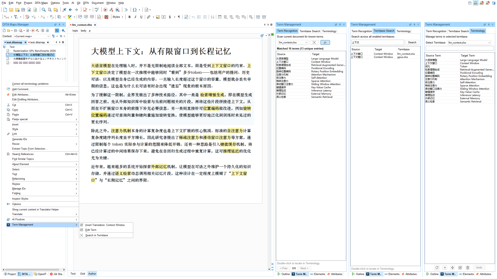

# 术语管理 (Term Management)

Oxygen XML Editor 插件，用于术语管理和翻译辅助。

## 截图



## 功能特性

### 术语识别
- 扫描当前编辑器文档，匹配选中的术语库中的术语
- 支持 Author 和 Text 两种编辑模式
- Text 模式下自动转义 XML 实体（`&`、`<`、`>`、`"`、`'`）后再匹配
- **Author 模式高亮** — 一键开关高亮，匹配的术语在文档中以黄色背景标记；开关状态按文档独立记忆（会话有效）
- **CJK 支持** — 正确识别中文、日文、韩文文本，无需依赖空格分隔；非 CJK 词使用词边界正则（`(?<![\\p{L}])TERM(?![\\p{L}])`）
- 双击匹配的术语行可跳转到**术语管理**标签页进行编辑
- **< 上一个** / **下一个 >** 按钮导航术语出现位置，附带位置标签（如 `3/12`）
- 导航计数按文档位置去重——术语库中的重复条目不会导致出现次数虚增
- **重复条目处理** — 同一源语在同一术语库中有多个译法时，结果表格中显示所有译法
- 统计标签显示 `Matched n terms (m unique entries)`
- 切换标签页或编辑器时自动扫描
- **后台扫描** — 扫描在后台线程中运行；扫描期间按钮被禁用，状态栏显示 "Scanning..."
- **主题感知 SVG 图标** — 图标自动适配 Oxygen 深色/浅色主题

### 右键上下文菜单
在编辑器中选中文本后，右键菜单出现 **Term Management** 子菜单：

| 菜单项 | 条件 | 动作 |
|--------|------|------|
| **Quick Add** | 有选中文本，且术语未存在于 Recognition 当前术语库 | 弹出 Quick Add 对话框，源语自动填入，光标在目标语输入框 |
| **Insert Translation** | 有选中文本，且匹配当前术语库中的已知术语 | 单条匹配直接插入；多条匹配弹出选择框 |
| **Edit Term** | 有选中文本，且匹配当前术语库中的已知术语 | 直接弹出编辑对话框（无需跳转到 Terminology 标签页） |
| **Search in Termbase** | 有选中文本 | 跳转到搜索标签页，填入搜索词并**在所有已启用术语库**中执行搜索 |

- 所有术语库操作（Insert、Edit、Quick Add）均基于 **Term Recognition 标签页当前选中的术语库**
- 检测到不连续多选（Ctrl+click）时，不显示 Term Management 菜单
- **多术语选区** — 如果选中文本包含 2 个及以上不同的已知术语，子菜单会显示一条禁用提示而非 Quick Add / Insert / Edit 菜单项；如果选中文本中多次出现同一个术语，菜单正常工作
- **稳健匹配** — 单个术语匹配出错时会被优雅捕获并输出到控制台，不会中断右键菜单构建或导致崩溃

### 术语管理
- 在单个术语库（TBX / XLSX / CSV）中添加、编辑、删除术语
- **快速添加** — 从当前编辑器选区创建术语，光标自动定位到目标语输入框
- **内联编辑** — 直接双击单元格修改，修改即时保存
- **撤销删除** — 支持一步撤销上次删除操作
- **重置排序** — 恢复原始行顺序并清除筛选条件
- **筛选术语** — 实时不区分大小写的正则筛选输入框
- **右键菜单** — 编辑术语 / 删除术语
- **中文排序** — 使用 `Collator.getInstance(Locale.CHINESE)` 进行列排序
- **重复检测** — 添加术语时检测源术语是否已存在（相同或不同译法均提示）
- **文件锁定检测** — 写入前检查文件是否被其他程序占用，对 XLSX 显示特定提示
- **用户可见的错误提示** — 加载、保存、重新加载失败时弹出提示对话框，不再静默失败
- **后台操作** — 术语库文件 IO（保存、重新加载）和文档扫描在后台线程中执行（SwingWorker），界面保持响应
- 批量删除带确认：`从 Y 中删除 X 个术语？`

### 术语库搜索
- 在所有已启用的术语库中模糊匹配（不区分大小写的子串匹配）
- 同时搜索源语和目标语术语
- 双击结果跳转到**术语管理**标签页进行编辑

### 术语库配置（首选项）
- 表格列：文件名、路径、格式、**状态**（`Enabled` / `Disabled` / `! Missing`）、**术语计数**
- **添加**术语库 — 原生文件对话框（支持多选、橡皮筋框选）
  - 重复路径检测（自动跳过）
  - 格式校验（不支持的文件格式自动跳过）
  - 加载错误处理 — 对话框可选**跳过**文件或**中止**全部操作
  - 空文件警告 — `"文件不包含任何术语。仍然添加吗？"`
  - 翻译冲突检测 — 添加前扫描已有术语库是否有源术语重叠
  - 添加后汇总信息（添加数 / 重复数 / 跳过数）
  - 上次使用的目录跨会话记忆
- **移除**术语库（不删除文件本身）
- **启用 / 禁用**术语库（无需移除）
- **重新加载**术语库（支持多选）
- **编辑**操作用系统默认应用打开术语库文件
- 配置通过 Oxygen 的 `WSOptionsStorage` 以 JSON 字符串持久化（使用 Gson 序列化）

### 术语条目对话框
- 源语（必填）和目标语输入框
- **Enter** 确认，**ESC** 取消
- 校验：源语不能为空

## 环境要求

- **Oxygen XML Editor** 27 或 28
- **Java** 17+
- **Maven** 3.6+（用于构建）

## 构建

1. 从您的 Oxygen XML Editor 安装目录复制 `oxygen.jar` 到 `libs/`：
   ```bash
   cp <OXYGEN_HOME>/lib/oxygen.jar libs/
   ```
2. 构建插件：
   ```bash
   mvn clean package
   ```

构建产物位于 `output/term-management/`。

## 安装

1. 构建插件（见上方）。
2. 将输出目录复制到 Oxygen 的 plugins 文件夹：
   ```bash
   cp -r output/term-management/ <OXYGEN_HOME>/plugins/term-management/
   ```
3. 重启 Oxygen XML Editor。
4. 通过 `Window > Show View > Term Management` 打开**术语管理**视图。
5. 在 `Preferences > Plugins > Term Management` 中配置术语库。

## 使用指南

### 首选项配置
1. 进入 `Preferences > Plugins > Term Management`。
2. 点击 **Add** 选择 TBX / XLSX / CSV 文件。
3. 选中一个术语库，点击 **Enable** / **Disable** 控制其可用状态。
4. 点击 **OK** 或 **Apply** 保存。

### 术语识别
1. 在 Author 或 Text 模式下打开 XML 文档。
2. 在**术语识别**标签页中，从下拉框选择一个术语库。
3. 点击 **Scan**（或切换标签页以自动扫描）。
4. 匹配的术语显示在表格中，附带命中统计标签。
5. 使用 **< 上一个** / **下一个 >** 按钮在文档中导航术语出现位置。
6. **双击**任意行跳转到**术语管理**标签页进行编辑。
7. **高亮开关** — 在 Author 模式下开关术语高亮。

### 术语管理
1. 切换到**术语管理**标签页。
2. 从下拉框选择一个术语库。
3. 使用工具栏按钮管理术语：
   - **Reload** — 从磁盘重新读取术语库
   - **Add** — 手动添加新术语
   - **Quick Add** — 使用当前编辑器选区作为源语快速添加术语，光标自动定位到目标语输入框
   - **Edit** — 修改选中的术语（仅支持单选）
   - **Delete** — 删除选中的术语（支持多选）
   - **Undo** — 恢复上次删除的术语
   - **Reset Sort** — 恢复原始行顺序并清除筛选
4. 使用表格上方的输入框**实时筛选**术语。
5. **内联编辑** — 直接点击单元格修改，即时保存。
6. **右键**点击行弹出编辑/删除菜单。

### 右键上下文菜单
1. 在编辑器中选中文本（Author 或 Text 模式）。
2. 右键点击，在弹出菜单底部（分隔线后）找到 **Term Management** 子菜单。
3. 根据选中文本是否匹配已知术语选择操作：
   - **Quick Add** — 将选中文本作为新术语添加到 Recognition 当前术语库
   - **Insert Translation** — 用译语替换编辑器中的选中文本
   - **Edit Term** — 直接编辑术语条目
   - **Search in Termbase** — 在所有已启用术语库中搜索
4. 无可用操作时子菜单自动隐藏。

### 术语库搜索
1. 切换到**术语库搜索**标签页。
2. 输入搜索词，点击 **Search**（或按回车键）。
3. 结果来自所有已启用的术语库。
4. **双击**结果跳转到**术语管理**标签页进行编辑。

## 支持的格式

| 格式 | 库 | 备注 |
|------|----|------|
| CSV | OpenCSV | UTF-8 带 BOM 编码，首行为表头，BCP 47 语言标签 |
| XLSX | Apache POI | 第一个工作表，首行为表头 |
| TBX（ISO 30042） | JDK DOM | 使用 `xml:lang` 属性检测语言；支持 `<tig>` 和 `<ntig>` / `<termGrp>` 结构 |

### 语言标识

语言标签遵循 **BCP 47** 标准（例如 `en-US`、`zh-CN`、`ja-JP`）。参考表见 [`language-tags-BCP-47.md`](./language-tags-BCP-47.md)。

## 项目结构

```
term-management/
├── plugin.xml                 # Oxygen 插件描述文件
├── extension.xml              # 扩展注册文件
├── pom.xml                    # Maven 构建文件
├── LICENSE
├── README.md
├── README.zh.md
├── assets/                    # README 截图
├── i18n/                      # 国际化资源（部署副本）
│   ├── messages_en.properties
│   ├── messages_zh.properties
│   ├── messages_fr.properties
│   ├── messages_de.properties
│   └── messages_ja.properties
├── licenses/                  # 第三方许可文件
├── libs/                      # Oxygen SDK 及其他本地 JAR
├── src/main/
│   ├── java/com/example/termmgmt/
│   │   ├── TermManagementPlugin.java
│   │   ├── TermManagementWorkspaceAccessExtension.java
│   │   ├── TermContextMenuInstaller.java
│   │   ├── model/
│   │   │   ├── TermEntry.java
│   │   │   └── TermbaseConfig.java
│   │   ├── service/
│   │   │   ├── TermbaseLoader.java
│   │   │   ├── CsvTermbaseHandler.java
│   │   │   ├── XlsxTermbaseHandler.java
│   │   │   ├── TbxTermbaseHandler.java
│   │   │   └── TermbaseRegistry.java
│   │   ├── prefs/
│   │   │   └── TermManagementPreferencePage.java
│   │   ├── util/
│   │   │   └── TermMatchUtils.java
│   │   └── ui/
│   │       ├── TermManagementView.java
│   │       ├── TermRecognitionPanel.java
│   │       ├── TermbaseSearchPanel.java
│   │       ├── TerminologyPanel.java
│   │       └── TermEntryDialog.java
│   └── resources/
│       ├── i18n/              # 实际起效的 i18n 资源文件
│       │   ├── messages_en.properties
│       │   ├── messages_zh.properties
│       │   ├── messages_fr.properties
│       │   ├── messages_de.properties
│       │   └── messages_ja.properties
│       └── icons/             # SVG 图标（8 个文件）
│           ├── logo.svg
│           ├── scan.svg
│           ├── toggle_highlight.svg
│           ├── reload.svg
│           ├── add.svg
│           ├── quick_add.svg
│           ├── edit.svg
│           └── delete.svg
├── src/test/java/com/example/termmgmt/service/   # 单元测试（仅覆盖 handler 层）
│   ├── CsvTermbaseHandlerTest.java
│   ├── XlsxTermbaseHandlerTest.java
│   └── TbxTermbaseHandlerTest.java
├── output/                    # 构建输出（不提交）
│   └── term-management/
└── reference/                 # 参考资料
```

## 开发

### 前置条件
- JDK 17+
- Apache Maven 3.6+
- Oxygen XML Editor 27+（用于 SDK JAR 和测试）

### 构建
1. 从您的 Oxygen XML Editor 安装目录复制 `oxygen.jar` 到 `libs/`：
   ```bash
   cp <OXYGEN_HOME>/lib/oxygen.jar libs/
   ```
2. 构建插件：
   ```bash
   mvn clean package
   ```

### 测试
单元测试覆盖三个术语库格式解析器（`CsvTermbaseHandler`、`XlsxTermbaseHandler`、`TbxTermbaseHandler`），包括读写往返、编码边界情况（UTF-8 BOM）、异常/边界输入、文件不存在等场景。

运行测试：
```bash
mvn test
```
注意：`mvn test` 只运行测试，不会生成插件包；生成可部署的 jar 需要运行 `mvn package`。

### IntelliJ IDEA 设置
1. 打开项目目录。
2. 确保项目 SDK 设置为 JDK 17。
3. 运行 Maven `package` 目标验证构建。

### 添加 Oxygen SDK 依赖
Oxygen SDK JAR（`oxygen.jar` 等）位于 `libs/` 目录，通过本地 Maven 仓库引用。仓库配置请参见 `pom.xml`。

## 许可

Apache License 2.0